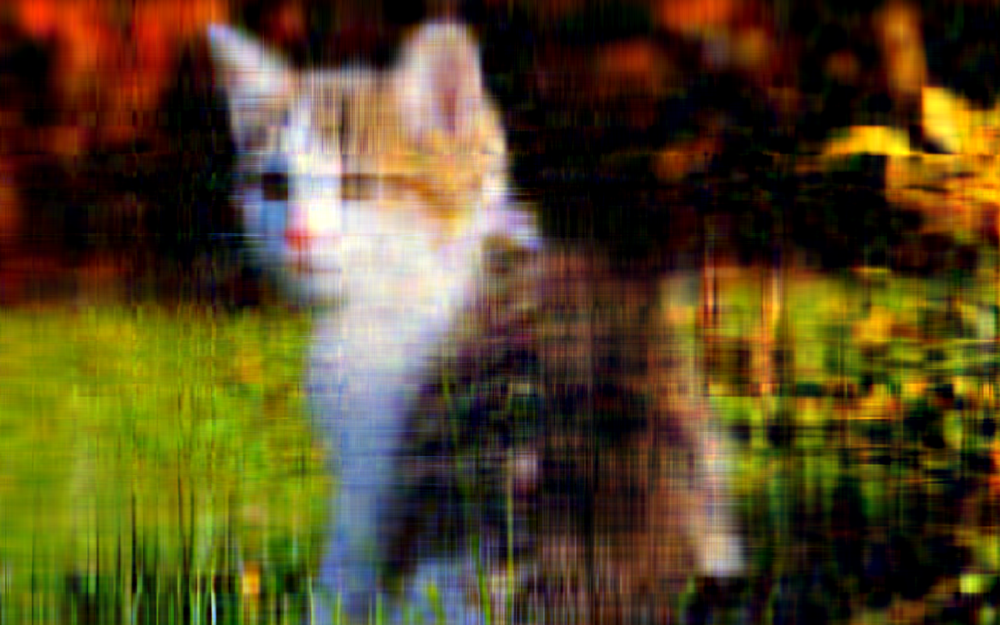

# SVD Image Compression (Color & Grayscale)
This project implements image compression via singular value decomposition (SVD) in Python.
It works for grasycale and color images, reconstructing them using given singular values.

## Features

- Automatically converts grayscale or RGBA images to RGB
- Performs SVD on each channel for color images
- Reconstructs images using k singular values
- Saves reconstructed images for portfolio/demo purposes
- Plots side-by-side comparisons for several k values

## Demo

| k=15 | k=25 | k=35 | k=45 |
|------|------|------|------|
|  |  |  |  |

## Getting started
### 1. Clone the repo
```bash
git clone https://github.com/omayovak/SVD_compression.git
cd SVD_compression
```
### 2. Install dependencies
```bash
pip install -r requirements.txt
```
### 3. Run the script
```bash
python svd_decomposition_color_images.py test.jpg --ks 15 25 35 45
```
This will display reconstructed images and save them in a results folder.
### 4. Customize as wanted
Use a different image, adjust --ks values, change --save_dir, etc.
